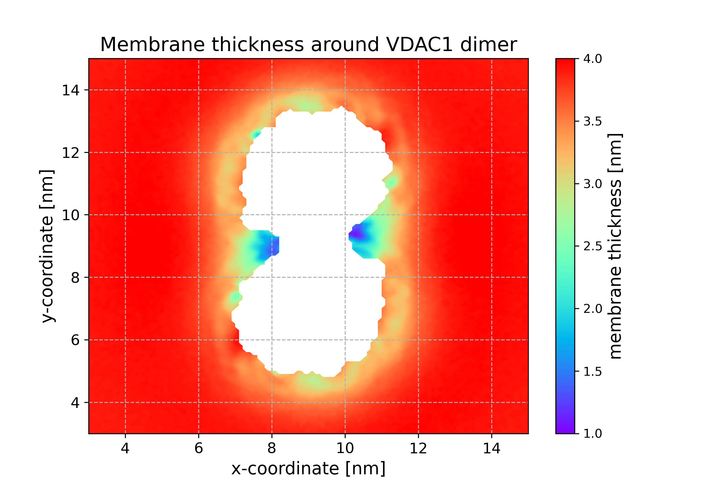

# memthick

Calculate 2D maps of membrane thickness. Rewrite of an older `memthick` program available from `https://github.com/Ladme/memdian`.

### Installation
1. [Install Rust.](https://www.rust-lang.org/tools/install)
2. Clone this repository:
```bash
git clone git@github.com:Ladme/memthick.git
```

or

```bash
git clone https://github.com/Ladme/memthick.git
```

3. Navigate to the `memthick` directory and compile the program.
```bash
cd memthick && cargo build --release
```

The compiled binary will be placed inside `./target/release`.

### How it works

`memthick` generates a mesh for every membrane leaflet with bins every 0.1 nm (by default) and calculates the average z-position of phosphate beads in each bin from the simulation trajectory. Membrane thickness is then calculated for each bin as the difference between the average z-position of phosphates in the upper-leaflet bin and the average z-position of phosphates in the corresponding lower-leaflet bin.

### Options

```
Calculate a 2D map of membrane thickness.

Usage: memthick [OPTIONS] --structure <STRUCTURE> --trajectory <TRAJECTORY>

Options:
  -s, --structure <STRUCTURE>
          Path to a gro, pdb, or tpr file containing the system structure.

  -f, --trajectory <TRAJECTORY>
          Path to an xtc file containing the trajectory to analyze.

  -o, --output <OUTPUT>
          Path to the output file where the density will be written.
          
          [default: membrane_thickness.dat]

  -n, --index <INDEX>
          Path to an ndx file containing groups associated with the system.

  -l, --lipids <LIPIDS>
          Specify atoms corresponding to membrane lipids.
          
          [default: @membrane]

  -p, --phosphates <PHOSPHATES>
          Specify atoms identifying lipid headgroups. Use only one atom per lipid molecule!
          
          [default: "name PO4 P"]

  -a, --nan <NAN_LIMIT>
          How many phosphates must be detected in a grid bin to calculate membrane thickness for this bin.
          
          [default: 30]

      --xmin <XMIN>
          Minimum coordinate for the x-dimension of the grid.

      --xmax <XMAX>
          Maximum coordinate for the x-dimension of the grid.

      --ymin <YMIN>
          Minimum coordinate for the y-dimension of the grid.

      --ymax <YMAX>
          Maximum coordinate for the y-dimension of the grid.

      --bin <BIN_SIZE>
          Size of a grid bin in each dimension (in nm).
          
          [default: 0.1]

  -h, --help
          Print help (see a summary with '-h')

  -V, --version
          Print version
```

When specifying lipid phosphates using the `-p` flag, note that `memthick` expects one phosphate atom per lipid molecule. For all-atom simulations, it is recommended to select phosphorus atoms of the membrane lipids.

When using `memthick` to analyze a membrane-protein simulation, it is advisable to center and RMSD-fit the protein. Otherwise, any interesting changes in membrane thickness might get averaged out.

### Example

```
memthick -s system.gro -f md_centered.xtc -l "resname POPC" --xmin=-2 --xmax 18 --ymin=-2 --ymax 18 -a 15
```

`memthick` will load atom information (but not coordinates) from `system.gro`. Every frame in the trajectory `md_centered.xtc` will be analyzed. The analyzed section of the simulation box can be specified using `--xmin`, `--xmax`, `--ymin`, and `--ymax` flags. In this case, `memthick` will analyze a block-shaped area spanning from `-2 nm` to `18 nm` on both x- and y-axes. Membrane thickness will not be calculated for bins with fewer than 15 samples (flag `-a`) in either leaflet (resulting in 'NaN' values for these bins).

All atoms from residues named `POPC` will be considered lipid atoms and used for membrane center calculation. Atoms named `PO4` or `P` (default) will be treated as phosphates/headgroups, and their average positions relative to the membrane center will be calculated. Phosphates/headgroups are assigned to leaflets based on their position relative to the membrane center: those above the center are assigned to the upper leaflet, those below to the lower leaflet. This assignment is performed for every trajectory frame.

Results are written to `membrane_thickness.dat` (default) in the following format:
```
# SPECIFICATION OF THE PROGRAM USED AND ITS VERSION
# ARGUMENTS OF THE COMMAND LINE
# See the average membrane thickness at the end of this file.
@ xlabel x coordinate [nm]
@ ylabel y coordinate [nm]
@ zlabel membrane thickness [nm]
@ grid --
$ type colorbar
$ colormap rainbow
X_COORDINATE1 Y_COORDINATE1 AVERAGE_THICKNESS_IN_THIS_BIN
X_COORDINATE1 Y_COORDINATE2 AVERAGE_THICKNESS_IN_THIS_BIN
X_COORDINATE1 Y_COORDINATE3 AVERAGE_THICKNESS_IN_THIS_BIN
...
X_COORDINATE2 Y_COORDINATE1 AVERAGE_THICKNESS_IN_THIS_BIN    <-- data are written in row-major order
...
# Average membrane thickness: AVERAGE_THICKNESS_ACROSS_THE_MEMBRANE
```

All units in the output file are in nanometers. Note that average thickness for a bin may be 'NaN' if insufficient data exists for that bin.

A plotted xy map of membrane thickness might look like this:


_This shows a membrane with a VDAC dimer (see https://www.nature.com/articles/s41467-023-43570-y) simulated using the Martini 3 force field. White areas represent regions occupied by the protein (with insufficient lipid samples)._